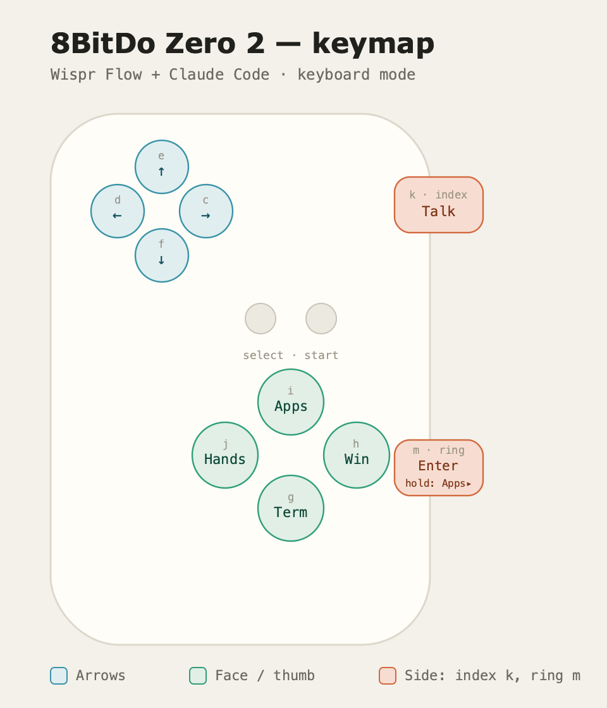

# 8BitDo Zero 2 → Wispr Flow + Claude Code (macOS)

Turn a ~$20 [8BitDo Zero 2](https://www.8bitdo.com/zero2/) into a one-handed controller for voice dictation and terminal work on macOS. Hold a trigger to dictate with [Wispr Flow](https://wisprflow.ai), tap another for Enter, steer with the D-pad, and use the face buttons to launch your terminal and switch windows and apps — all without touching the keyboard.



It works by running the Zero 2 in its **keyboard mode**, where each button sends a letter, then using **[Karabiner-Elements](https://karabiner-elements.pqrs.org)** to remap those letters — scoped to the controller only — into the keys and shortcuts Wispr Flow and your terminal expect.

**→ [Open the keymapper](zero2-keymapper.html)** to generate a config for your own device (pick a terminal, enter your device IDs, remap anything), or use the default layout below.

---

## What you get

- **Hold to dictate** — push-to-talk into Wispr Flow on the index-finger trigger
- **Tap to submit** — Enter on the ring-finger trigger, so dictate-then-send never leaves your trigger fingers
- **Arrow keys** on the D-pad for navigating Claude Code and menus
- **Launch / focus your terminal**, **cycle terminal windows**, and **cycle apps** on the face buttons
- An **app-switcher layer** on the same ring-finger trigger — hold it and the D-pad steps through every open app

## You'll need

- macOS
- An 8BitDo Zero 2 (Bluetooth)
- [Karabiner-Elements](https://karabiner-elements.pqrs.org) (free)
- [Wispr Flow](https://wisprflow.ai)

---

## Setup

### 1. Pair the Zero 2 in keyboard mode

1. Turn the controller off.
2. Hold **Start + R** while powering on — this is keyboard mode (the LED blinks 5 times per cycle).
3. Hold **Select for ~3 seconds** to enter pairing (the LED blinks rapidly).
4. In macOS Bluetooth settings, connect to **8BitDo Zero 2 gamepad**.

macOS will pop the **Keyboard Setup Assistant** (it thinks a new keyboard appeared). You can't press the key it asks for, so dismiss it: click the red close button, press **⌘Q**, or just tap the key to the right of the left Shift on your *built-in* keyboard. Once identified, it stops nagging.

### 2. Install Karabiner-Elements

1. Install it and grant **Input Monitoring** under System Settings → Privacy & Security.
2. Open Karabiner-Elements → **Devices** tab and make sure the Zero 2 is **enabled** (checkbox). If it isn't listed/enabled here, Karabiner ignores it entirely — this is the #1 reason "nothing happens."

### 3. Find your device IDs

Open **Karabiner-EventViewer**, press any Zero 2 button, and note the `vendor_id` and `product_id`. Every rule is scoped to these IDs so your real keyboard is never affected.

### 4. Generate and install your config

Open the **[keymapper](zero2-keymapper.html)**, enter your IDs, choose Terminal.app or iTerm2, and tweak any mappings. Then install one of two ways:

**Manual**

1. Download `8bitdo-zero2.json` (or use the included one).
2. Move it to `~/.config/karabiner/assets/complex_modifications/`.
3. Karabiner-Elements → **Complex Modifications** → **Add rule** → enable the Zero 2 rule.

**One-click import**

Paste this into your browser's address bar — it can't be a clickable link because Markdown doesn't allow custom URI schemes:

```
karabiner://karabiner/assets/complex_modifications/import?url=https%3A%2F%2Fraw.githubusercontent.com%2Fr005ter%2Fzero2-keymap%2Fmain%2F8bitdo-zero2.json
```

This imports the default layout. Its `vendor_id` / `product_id` are preset for the Zero 2 (they identify the controller *model*, so they're the same for every Zero 2 in keyboard mode), so it works out of the box. If your controller's firmware reports different IDs — check [EventViewer](https://karabiner-elements.pqrs.org) — edit the rule in Karabiner or regenerate a file in the [keymapper](zero2-keymapper.html).

---

## Default layout

| Button | Key it sends | Function |
| --- | --- | --- |
| D-pad up / down / left / right | `e` `f` `d` `c` | Arrow keys |
| `m` — lower side (ring) | `m` | **Enter** (tap) · **app-switcher layer** (hold) |
| `k` — upper side (index) | `k` | **Push-to-talk** (Ctrl + Opt, held) |
| `j` — left face | `j` | **Hands-free** toggle (Fn + Space) |
| `g` — bottom face | `g` | Launch / focus terminal |
| `h` — right face | `h` | Cycle terminal windows (⌘ + `` ` ``) |
| `i` — top face | `i` | Cycle apps (⌘ + Tab) |

The two side buttons sit under your index and ring fingers, so the core loop — **hold `k` to dictate, tap `m` to send** — happens entirely on your triggers while your thumb stays on the D-pad. And because the triggers are fingers, not thumb, **holding `m` while working the D-pad** is the one comfortable two-button chord — which is exactly where the app-switcher layer lives.

## Wispr Flow shortcuts

Set these in Wispr Flow → Settings → General → Shortcuts so they match the controller:

- **Push-to-talk** → `Ctrl + Opt` (matches `k`)
- **Hands-free** → `Fn + Space` (matches `j`)

If Fn behaves oddly (macOS treats it specially), rebind hands-free to something plain like `⌘⇧Space` in Wispr and update the `j` mapping to match.

## App-switcher layer

**Hold `m`** (instead of tapping it for Enter) and Command is held for you — lazily, so nothing fires until you press something else. While holding, D-pad **left/right** become Shift+Tab / Tab: the ⌘Tab switcher comes up, *stays* up, and you step through every open app. **Release `m` to land on the selected one** — real cycling, not the two-app toggle a single ⌘Tab tap gives you. (Up/down still send arrows, so ↓ opens Exposé on the highlighted app, just like on a keyboard.)

Why it's on `m`: the switcher only stays open while ⌘ is physically held — macOS commits the moment it's released, so a tap-to-latch version isn't possible. The hold has to live on a button your fingers can keep down *while* your thumb works the D-pad, and that's the ring-finger trigger.

Details:

- A quick tap of `m` is still plain **Enter** — the layer only engages while held (Karabiner's `to_if_alone`).
- Holding `m` for over a second without touching the D-pad does nothing — no stray Enter on release.
- In the keymapper you can move the layer to any button, with (**Enter (tap) / app switcher (hold)**) or without (**App-switcher layer (hold)**) the Enter tap.

---

## Troubleshooting

- **Nothing happens at all** → the Zero 2 isn't enabled in Karabiner's Devices tab, the `vendor_id`/`product_id` don't match EventViewer, or the rule isn't enabled.
- **Keyboard Setup Assistant keeps appearing** → dismiss it once (see step 1); it stops after the keyboard is identified.
- **Hands-free won't trigger** → Fn combos can be flaky; rebind it in Wispr to a plain combo and update `j`.
- **⌘`` ` `` does nothing** → it only cycles windows of the *frontmost* app, so Terminal/iTerm must already be in front.
- **First press after idle is ignored** → the controller went to sleep; the first press wakes it, the next one registers.

## Caveats

- A single ⌘Tab tap (`i`) only toggles the two most-recent apps — hold `m` and use the D-pad for true cycling.
- Holding `m` no longer key-repeats Enter (the hold is the app-switcher layer now).
- The Zero 2 has ~8 usable inputs, so budget buttons carefully.
- The micro-USB port is for charging and firmware only; pairing is Bluetooth.

## Files

- `zero2-keymapper.html` — interactive config generator (also served by this site)
- `8bitdo-zero2.json` — example config (default layout, preset Zero 2 device IDs)
- `zero2-keymap.png` / `zero2-keymap.svg` — keymap image and source

## License

MIT — do whatever you like.
